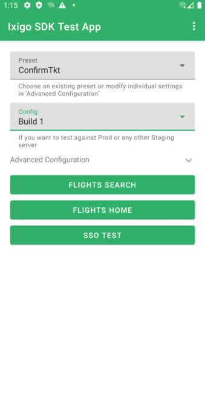

# Development

## Setup development environment

# Development

## Setup development environment

1. Add a personal Gitlab Token as an environment variable called `NPM_TOKEN`
   1. This is needed to use [Gitlab NPM Registry](https://docs.gitlab.com/ee/user/packages/npm_registry/) for some custom npm dependencies needed for build process.
   1. [Create the personal token](https://docs.gitlab.com/ee/user/profile/personal_access_tokens.html#create-a-personal-access-token)
   1. Edit your `bash_profile` file (or `.zprofile` or which ever shell you use) and add `export NPM_TOKEN=<GITLAB_PERSONAL_TOKEN>`
1. Install [yarn](https://classic.yarnpkg.com/lang/en/)
   1. I used homebrew: `brew install yarn`
1. Clone the repository and initialize
   1. `git clone git@git.ixigo.com:android/ixigo-android-sdk.git`
   1. `cd ixigo-android-sdk.git`
   1. `yarn install`
1. Install latest [Android Studio](https://developer.android.com/studio/install)
1. Import `ixigo-android-sdk` project in Android Studio
1. Run the sample App

## Development

Most of the development should be done agains Unit Tets and against our Sample App.

## Code Format

We use [ktfmt](https://github.com/facebookincubator/ktfmt) to format our code.

We use [spotless](https://github.com/diffplug/spotless) in gradle to run ktfmt.

We enforce it via:

- **Git pre-commit hook:** installed via `yarn install` and running `spotlessApply` gradle task to automatically format files
- **CI**: invoking `spotlessCheck` gradle task and failing the build if there are formatting errors.

If you want, you can also install ktfmt plugin for Android Studio. Find instructions [here](https://github.com/facebookincubator/ktfmt#intellij-android-studio-and-other-jetbrains-ides)

## Create a new commit

We use [standard-version](https://github.com/conventional-changelog/standard-version) to handle commits and releases.

This means our commits need to follow the standard message. If you don't, you might find a pre-commit hook that prevents your commit.

To create a commit that always complies you can create it using `yarn run commit`. This will guide you through creating a compliant ommit message.

## Analytics

Metrics of the SDK are collected using [Google Analytics](https://developers.google.com/analytics/devguides/collection/android/v4) Legacy (not GA4). The rationale for this is:

- We can't use Firebase Analytics since it only works with 1 Firebase App, and analytics would go to the host Firebase App.
- GA4 for mobile forces you to use Firebase

Analytics Account Id: [211766096](https://analytics.google.com/analytics/web/#/report-home/a211766096w295339199p256394053). Contact miguel@travenues (or rajnish@travenues) for access if needed.

## RemoteConfig

It is possible to configure certain aspects of the SDK using Firebase Remote Config.

The Firebase App is [Ixigo SDK](https://console.firebase.google.com/project/ixigo-sdk-demo-app). Contact miguel@travenues or rajnish@travenues for access if needed.

## Release a new version

To release a new version:

1. Find the pipeline for the commit you want to release in [development` branch](https://git.ixigo.com/android/ixigo-android-sdk/-/pipelines?page=1&scope=all&ref=development&status=success) and click on it.
2. To preview the changelog that will be generated:
3. Find the job in `release` stage called `release-preview`
4. Browse the artifacts and open `build/CHANGELOG.pdf`. For instance, if the `release-preview` id job of your job is `123456`, the preview of the changelog will be at https://git.ixigo.com/android/ixigo-android-sdk/-/jobs/123456/artifacts/file/build/CHANGELOG.pdf
5. In the pipeline page, click on ▶ in the `release` job to release the sdk

