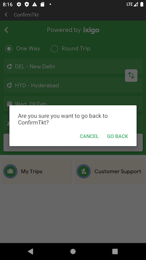

[[_TOC_]]

# Installation

## Add dependency

Inside **root/build.gradle**

```groovy
buildscript {
  repositories {
    // Other repositories...
    maven { url 'https://nexus.ixigo.com/nexus/content/repositories/androidshared' }
  }
}

```

Inside **app/build.gradle**

```groovy
dependencies {
  // Other dependencies...
  implementation "com.ixigo.sdk:ixigo-sdk:3.6.2"
}

```

### Use Snapshots

If you want to test the latest development that is not yet published as a new version, you can add a dependency to our snapshot repository instead.

Inside **root/build.gradle**

```groovy
buildscript {
  repositories {
    // Other repositories...
    maven { url 'https://nexus.ixigo.com/nexus/content/repositories/androidshared-snapshots' }
  }
}

```

Inside **app/build.gradle**

```groovy
dependencies {
  // Other dependencies...
  implementation "com.ixigo.sdk:ixigo-sdk:3.6.2-SNAPSHOT"
}

```

Note that changing versions are cached for 24h by default. If you want to get a very recent update, you need to configure this threshold to be smaller. See https://docs.gradle.org/current/userguide/dynamic_versions.html#sec:controlling-dynamic-version-caching

For instance, inside `build.gradle` of the module where you added the dependency, you could add

```groovy
configurations.all {
    resolutionStrategy.cacheChangingModulesFor 0, 'seconds'
}

```

## Enable Desugaring if needed

We use certain Java 8 features in the SDK. If you are targetting a minSDK < API 26, please [enable desugaring](https://developer.android.com/studio/write/java8-support#library-desugaring) on your App to make sure the App works correctly for older devices.

To enable desugaring, modify your `app/build.gradle` like this:

```groovy
compileOptions {
  // Flag to enable support for the new language APIs
  coreLibraryDesugaringEnabled true
  // Sets Java compatibility to Java 8
  sourceCompatibility JavaVersion.VERSION_1_8
  targetCompatibility JavaVersion.VERSION_1_8
}

dependencies {
  // Other Deps
  coreLibraryDesugaring 'com.android.tools:desugar_jdk_libs:1.1.5'
}
```

# Usage

## Initialize the SDK

Initialize the SDK calling in your App creation flow. You can only initialize it once.

```kotlin
val appInfo = AppInfo(
  clientId = "<CLIENT_ID>",
  apiKey = "<API_KEY"),
  appVersion = BuildConfig.VERSION_CODE.toLong(),
  appName = "<APP_NAME>"
)
IxigoSDK.init(context, appInfo, authProvider, /* Other params */)
```

Access the SDK via its singleton Accessor from an Activity or Fragment

```kotlin
IxigoSDK.instance.flightsStartHome()
```

### Use staging servers

For development purposes, you might want to point the SDK to one of ixigo's staging servers: `build1.ixigo.com`, `build2.ixigo.com`...

You can configure your endpoint while initializing the SDK like this:

```kotlin
IxigoSDK.init(context = context, config = Config.StagingBuildConfig("build3"), /* Other params */)
```

If you want to use a non standard enpoint, you can use `Config` constructor directly:

```kotlin
val config = Config(apiBaseUrl = "http://mycustomhost.com/api")
```

## Logging

If you want to enable logging in your Debug Builds, do something like this

```kotlin
if (BuildConfig.DEBUG) {
  ixigoSDK.setLoggingConfig(LoggingConfig(enabled = true))
}
```

## Authentication

When opening ixigo SDK it is possible to login the user automatically into their ixigo account by exchanging the host App token for an ixigo token. To do that, you need to implement `PartnerTokenProvider` and pass it when initializing `IxigoSDK`

```kotlin
class MyAppPartnerTokenProvider(): PartnerTokenProvider {
  override fun fetchPartnerToken(
      activity: Activity,
      requester: PartnerTokenProvider.Requester,
      callback: PartnerTokenCallback
  ) {
    // Fetch your Host App token if available
    val partnerToken: PartnerToken = /* TODO */
    if (partnerToken == null) {
      // If you could not find it, return the appropiate error.
      callback(Err(PartnerTokenErrorNotLoggedIn()))
    } else {
      // Return the Token
      callback(Ok(partnerToken))
    }
  }
}

IxigoSDK.init(authProvider = MyAppPartnerTokenProvider(), /* Other params*/)
```

`PartnerTokenProvider.Requester` should be used by your implementation to determine how to obtain the token. For instance, if we pass `CUSTOMER` as `RequesterType`, it would be OK to present a LoginDialog since the Customer initiated this request. Otherwise, we should not show any UI to the customer.

### Using Activity for Result

If your `PartnerTokenProvider` implementation starts another activity for result (eg: open login dialog), you can implement as well `ActivityResultHandler` to get a callback when the Activity is finished

```kotlin
class MyPartnerTokenProvider(): PartnerTokenProvider, ActivityResultHandler {

  // ...

  override fun handle(requestCode: Int, resultCode: Int, data: Intent?): Boolean {
    TODO("Handle Activity Result")
  }
}
```

### Logout

When the customer logs out in your app, call `IxigoSDK.instance.onLogout`. This will remove all info stored/cached about the logged in user.

## [Payment](payments/USAGE.md)

See payment Usage documentation [here](payments/USAGE.md)

### Using Actvity for Result

If your `PaymentProvider` implementation starts another activity for result, you can implement as well `ActivityResultHandler` to get a callback when the Activity is finished

```kotlin
class MyPaymentProvider(): PaymentProvider, ActivityResultHandler {
  override fun startPayment(activity: FragmentActivity, input: PaymentInput, callback: PaymentCallback): Boolean {
      TODO("Handle payment")
  }

  fun handle(requestCode: Int, resultCode: Int, data: Intent?): Boolean {
    TODO("Handle Activity Result")
  }
}

```

## Analytics

You can get access to events generated by the SDK and log them to your own platform. To do so, you need to create an implementation of `AnalyticsProvider`.

```kotlin
class MyAppAnalyticsProvider() : AnalyticsProvider {
  override fun logEvent(event: Event) {
    // TODO: log events using Firebase, CleverTap, etc...
  }
}
```

You can set your implementation of `AnalyticsProvider` while initializing the SDK

```kotlin
IxigoSDK.init(analyticsProvider = MyAppAnalyticsProvider(), /*...Other init params */)
```

## Configure Appearance

### Theming

You can configure the appearance of certain UI elements in 2 ways

#### Android Resources

Overwrite the following keys in your resources files

```xml
<resources>
  ...
  <!-- Primary color: will be used in several UI elements. eg: status bar bg color-->
  <color name="ixigosdk_primary_color">#FF0000</color>
</resources>

```

#### Provide a Theme object

Pass a `Theme` object when initializing the SDK

```kotlin
IxigoSDK.init(theme = Theme(...), /*...Other init params */)
```

### Exit Top Bar

The SDK will show a thin navigation bar on top of the content to allow the customer to exit at any time. If you want to remove it, pass `enableExitBar = false` inside `Config` object when initializing IxigoSDK.

```kotlin
IxigoSDK.init(context, config = Config(enableExitBar = false), /* other parameters */)
```

|  |  |
| ---------------------------- | ----------------------------------------- |

### Customize Strings

Strings used in the SDK can be overriden by the Host App by redeclaring these strings in the App resources `strings.xml` file.

See the available string keys and values [here](ixigo-sdk/src/main/res/values/strings.xml)

## Deeplinks

You can hook into ixigo SDK internal navigation in case you want to handle a particular URL in the Host App directly.
To do so, implement `DeeplinkHandler` and pass it to `IxigoSDK` when initializing:

```kotlin
IxigoSDK.init(deeplinkHandler: MyDeeplinkHandler(), /* other params */)
```

## Entry Points / Functionality

### Flights

#### Start Flights Funnel

```kotlin
IxigoSDK.instance.flightsStartHome(context)
```

#### Start Flights Trips

Displays a list of the flight trips booked by the customer

```kotlin
IxigoSDK.instance.flightsStartTrips(context)
```

You can also get a Fragment to embed it in your UI

```kotlin
val fragment = IxigoSDK.instance.flightsTripsFragment()
// Add this fragment to your Activity/Fragment
```

#### Flights Multimodel Search

Use this method to get a Fragment showing Flight trips for a particular search input.
This is useful to integrate in your App's UI where you already have a search form

```kotlin
val searchData = FlightSearchData(...)

val fragment = IxigoSDK.instance.multiModelFragment(searchData)
// Add this fragment to your Activity/Fragment
```

### Buses

In order to access Buses functionality, you need to initialize `BusSDK` after `IxigoSDK` initialization

```kotlin
IxigoSDK.init(...)
BusSDK.init(...)
```

#### Start Bus Funnel

```kotlin
BusSDK.instance.launchHome(context)
```

#### Open Bus Trips

Use this method to open a view showing your Bus bookings

```kotlin
BusSDK.instance.launchTrips(context)
```

#### Open Additional Bus Trips

Use this method to open a view showing additional Bus Trips.
This is used to display older bus trips a customer might have booked in other platforms

```kotlin
BusSDK.instance.launchAdditionalTrips(context)
```

#### Bus Multimodel Search

Use this method to get a Fragment showing Bus trips for a particular search input.
This is useful to integrate in your App's UI where you already have a search form

```kotlin
val searchData = BusSearchData(...)

val fragment = BusSDK.instance.multiModelFragment(searchData)
// Add this fragment to your Activity/Fragment
```

#### Get Cheapest Fare

Use this method to get the cheapest bus fare for a given trip

```kotlin
BusSDK.instance.getCheapestFareTrip(CheapestFareInput(...)) {
  when (it) {
    is Ok -> // `it` contains CheapestFareOutput
    is Err -> // Handle Error
  }
}
```

### Trains

In order to access Trains functionality, you need to initialize `TrainsSDK` after `IxigoSDK` initialization

```kotlin
IxigoSDK.init(...)
TrainsSDK.init(...)
```

#### Start Trains Funnel

```kotlin
TrainsSDK.instance.launchHome(context)
```

#### Open Train Trips

Displays a list of the train trips booked by the customer

```kotlin
TrainsSDK.instance.launchTrips(context)
```

You can also get a Fragment to embed it in your UI

```kotlin
val fragment = TrainsSDK.instance.tripsFragment()
// Add this fragment to your Activity/Fragment
```

### Covid

#### Open vaccination appointment

```kotlin
IxigoSDK.instance.covidLaunchAppointments(context)
```

### Screenshots

| Flights                                                   | Trains                                     | Bus                                               |
| --------------------------------------------------------- | ------------------------------------------ | ------------------------------------------------- |
| Flights Home<br>              | Trains Home<br> | Bus Home<br>              |
| Flights Search<br>          |                                            | Bus MultiModel<br> |
| Flights MultiModel<br> |                                            |                                                   |
| Flights Trips<br>            |                                            |                                                   |
| Covid Appintment<br>     |                                            |                                                   |
